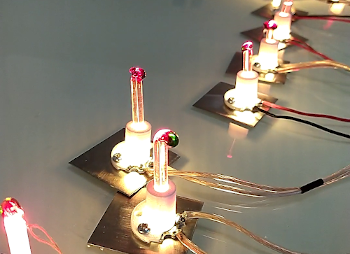

## Asynchronous Multi-Channel PWM Control

The included code is written in microPython, prepared for a Raspberry Pi Pico.  
The code provides control of 3 pwm outputs by default. It is possible to add up to 16 channels on a Raspberry Pi Pico. 
The behavior is much like using the millis() function in Arduino, thus removing any delays and achieving asynchronous behaviors. The code was prepared for a project by Lucie Bombasaro at ESAM Caen/Cherbourg 

### Video of the result is available here:  

